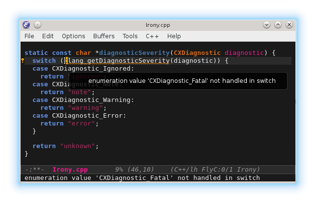

# Flycheck checker for [irony-mode][irony-mode-ref]

This package provides a [flycheck][flycheck-ref] checker for the C, C++ and
Objective-C languages.

## Installation

The recommended way to install `flycheck-irony` and its dependencies is through
a package manager:

* Using [MELPA](http://melpa.milkbox.net/)

        M-x package-install RET flycheck-irony RET

## Configuration

~~~el
(eval-after-load 'flycheck
  '(add-hook 'flycheck-mode-hook #'flycheck-irony-setup))
~~~

[irony-mode-ref]: https://github.com/Sarcasm/irony-mode "Irony Mode"
[flycheck-ref]: http://www.flycheck.org                 "Flycheck"
